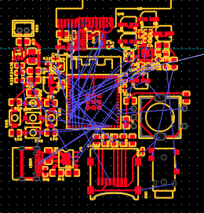
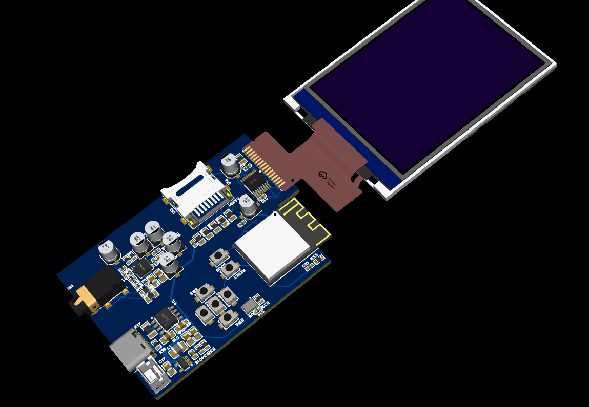

# September 3rd: Set up the Github repository and planned out idea

Today I found out about Grounded and thought it was the perfect opertunity to build a project I have always wanted to build. The project is a minimalist cellphone for myself. The goal is to include all the necessities such as texting, calling, music, weather, etc. I also wanted to add back those old phone keyboards since I hate typing on a phone. Meanwhile, I am going to cut out distractions such as social media and also hopefully be cheaper then a regular phone. 

I did not get much chance to work today, I mainly just jotted down a few ideas for the apps, as well as the phone design and components i wanted to use. No pictures to show for today!

**Total time spent: 30min**

# September 4th: Sourcing the components for the project

Today i began by doing some research on makinga 'phone'. Then I went on LCSC.com and started searching for the components. so far i have got all the components for the core electronics (esp32, SIM7600G), Power management (LiPo, TP4056), and started on finding an apropriete screen. I was originally going to use the A7670G for the cellular since it was pretty cheap ($9) but it has no good support on the US, so i had to move to the more costly but robust SIM7600G ($28 :0). Becides that things went pretty smoothly. Here is a list of the things i have so far (dont mind the quantities)

**Total time spent: 2h**

# September 5th: started schematic

Today i istarted on the schematic on easyeda. i loaded in the esp32 and the SIM7600G. the cellular module has SO MANY pins (135). I was reading the datasheet most of the time, but i did connect the VCC and GND for the cellular module. Apperently i need static discharge protection for the sim lines but i dont know if it is worth all the extra trouble, since i cant find a good TVS diode array for all 4 lines. I geuss we will figure out tommorow

Here is picture of schematic so far (im a slow worker)

**Total time spent: 2h**

# September 7th: Finished core electronics and lipo charging:

Today i worked on finishing the connections for the SIM7600G. They are still a little sketchy, especially the ESD protection and decoupling caps (I am pretty new to this). I also added in the usb-c and the TP4056 for the lipo charging. The connections were pretty easy, and the esp32-s3 has USB support, so i didnt even need a usb-uart bridge. Overall, the progress is going pretty slow, considering i only have 2 more weeks... 

I was also thinking i could simplify the design by removing the keyboard. instead, like a smartphone, i would just add a large touch screen. This kinda ruins one of the main parts of the phone, but i have an idea to fix that. basicly, i want to make the phone a little modular. It will require some planning, but if i expose the extra gpio pins in the right places i can make add ons that connect to those pins. Stuff like a camera, keyboard, better microphone/speakers, ...honestly anything you can imagine on a breakout board. I will have to plan where to expose the pins though.

Here is a picture of the scematic so far.

**Total time spent: 2h**

# September 8th: BIG change to the project:

I kinda realised i am making a flip phone with crappier software. Honestly, I should have seen that coming. The problem is I didnt realise how difficult it would be to make a phone. The hardware was fine, but there is also all the firmware and i dont want to do all of that. SO instead i am going to pivot to a simpler, easier, project. A Smart MP3 Player. Imagine this: download songs, play songs, play radio, screen, voise recorder, etc. Basicly a screen without messaging. SOund way easier to implement. I am changing the project name to SmartMP3 temperarily. 

Project will be based on a capacitive screen with esp32-s3.

**Total time spent: 1h**

# September 9th: getting all the components:

Today I researched all the components i would need for my project. It started off simple, an esp32-s3-mini, a ES8388, and some other random parts. then I thought it would be really cool to add a blutooth audio module since i mainly listen to music on my airpods. But, I could not find a single one on LCSC! This was really dissapointing. I will keep looking but i might need to buy a BT audio breakout board (a few dollars online) and add it to the pcb. 

I have attached picture of the new schematic. It took 2 hrs to do this bc i spent like an hour finding the BT audio module :(

# September 10th: Finished ES8388 and started HS28B02A:

Today I worked on the ES8388 (the AMP) and the HS28B02A (LCD screen). finishing the Amp was pretty easy, there were a few signals like the MCLK which i didn't know how to get. Turns out the ESP32 can supply that. I also started on the HS28B02A but it has almost no resources online apart from a vague datasheet that does not match the schematic symbol with obscure pin descriptions. So, I may move to a more popular screen at the expense of price.

Its crunch time, so i really hope i can finish this in time. I think if i take a few more days for the schematic, I can quickly do the routing and get this done.

**Total time spent: 2h**

# September 11th: Locked in and finished most of the connections:

I locked in today and finished the LCD, added a touch module, wired the TP4056, and wired the USB connecter. Most of today was spent leraning about the SPI protocol since i was really confused on how that works. Noot much else to day, so here is the schematic. I think i can finish it tommorow and then check all the connection the day after.

**Total time spent: 2h**

# September 12th: Worked on schematic a little bit more:

I worked on the SD card connector and the button inputs.

**Total time spent: 1h**

# September 14th: Finished the schematic!

I finaly finished the schematic for my mp3 player. The communication protocols were really messy so i had to fix that bc i have multiple SPI, I2C, and I2S devices all on the board. The gpio pins on the esp32 are also pretty randomly used so I am worried that I don't use a gpio pin that is used for something else. But, we are really running out of time so i am going to start weith the component placement.

Most of the time today was spent organising the GPIO pins since when i routed them i didn't really understand all the different communication protocols. 

**Total time spent: 2h**

# September 15th: Started the schematic.

I locked in today and finished most of the schematic. What i did was I grouped up the components which were connected together in the schematic and then wired and arranged those up. then i slowly added on the other blocks to make a pcb. I havent wired everything yet, but all of he subsystems are wired up. The only thing is I don't really like the way the subsystems are arranged. Normally I would just redo it, but I already closed the project so now I can't just spam the undo button.

**Total time spent: 3h**

# September 16th: Worked on schematic.

Today I started routing the schematic. not much else to say. The gpio pins were places randomly so the signal wiring is sooo messy. I think I will have to change that if i want to submit. 

I also submitted to electronics slack for advice. Nothing has come yet.

**Total time spent: 2h**

# September 19th:upgraded the schematic:

I took a little break to work on other things, but i am back. Some people gave me advice for my PCB. first, they said to remove the pullups on the buttons. Apperently, the esp32-s3 has built in pullups on all of its gpio which is really cool. I also am really new to mixed-signal pcbs, so I had to learn that and seperate the analog from the digital components. I made a little corned of analog on the pcb. Lastly, I redid ALL of the gpio pins. the pcb signal wires are looking beutiful now! Lastly, I added a ground pour on the back of the pcb. The pcb is looking much better. I am getting ready to subm,it, but i posted it on the slack one more time just in case i made a stupid mistake. 

**Total time spent: 2h**

# September 20th: Finished the PCB and submitted:

I heard back from the community and moved the esp32 so that the antenna was at the edge. I also moved the headphone jack so i t was at the edge. Now i am going through the lengthy process of submitting the pcb.

**Total time spent: 1h**
