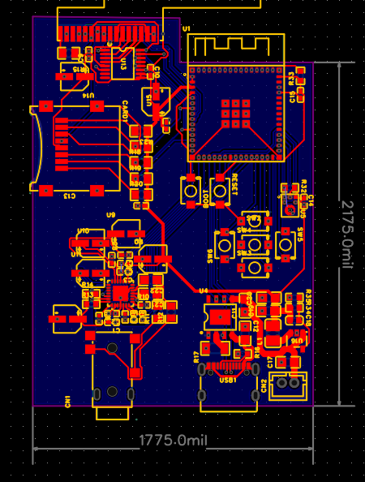
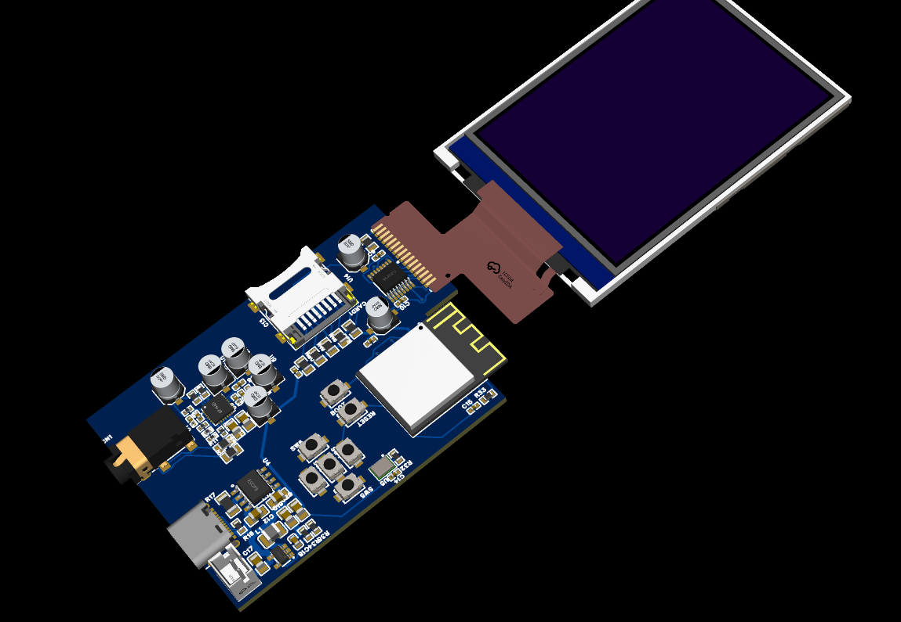

# SmartMP3  

## Description  
SmartMP3 is a DIY MP3 player I’ve been building from scratch. It’s powered by an ESP32-S3 and uses a touchscreen for control instead of buttons. The goal is to make something that feels like a modern device, but is completely custom-built and designed at the PCB level.  

I wanted this project to be more than just “play music.” With the parts I’ve chosen, SmartMP3 can handle audio playback, recording, and charging, all while staying compact and portable.  

## Images
Check in the images folder for all the images

## Project Features  
- **ESP32-S3** – The brain of the MP3 player. Handles audio decoding, Bluetooth (future feature), and touchscreen input.  
- **Touchscreen + Touch Controller** – No buttons, just direct touch control for menus and playback.  
- **ES8388 Audio Codec** – Provides high-quality stereo audio output and integrates well with the ESP32 for I²S.  
- **ICS-43434 Digital Microphone** – Allows basic voice recording or other mic-based features.  
- **Headphone Jack** – Standard 3.5mm jack for wired headphones.  
- **USB-C Port** – For charging and possibly data transfer later on.  
- **TP4056 Charger IC** – Manages charging the lithium battery safely.  
- **LDO (Low Dropout Regulator)** – Keeps the ESP32 and audio components powered at a stable voltage.  

## Installation Guide  
Right now, there isn’t any software to install yet. Once I start working on the firmware, I’ll add step-by-step instructions here for flashing the ESP32-S3 and loading music onto the device.  
